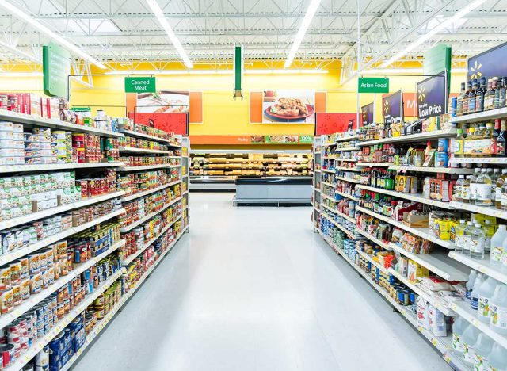

# Superstore Analysis

## Introduction
This is the project I worked on in my data analytics bootcamp. I love how rich and vast the dataset is to practice my skills on data cleaning, analysis and visualizations. This project is to analyze the data and derive actionable insights in order to answer some critical business problems.

## Skills Demonstrated
Some Power BI features were used including DAX, Modeling, filters etc.

## Problem statement
- Which product category has the highest sales for the year in consideration?
- The region with the highest sales in all the categories
- The sales and orders trend between the year 2010 to 2013

## Data Sourcing
The dataset was provided by the instructor which i extracted into the Power BI for cleaning, analysis and visualization. It contains 9427 rows and 24 columns

## Data Transformation and Cleaning
Data was efficiently cleaned and transformed using the Power Query Editor of Power BI. To calculate the total sales and total number of orders, I used the DAX concepts.
DAX function                                                                                        |   Result
:--------------------------------------------------------:                                          |:---------------------------------                                
     | 
                | 
## Data Analysis and Visuals

- From the dashboard, it is observed that there are three(3) product categories with the Technology category topping the chart in terms of sales for the year in consideration.
- The Central region has the highest sales followed closely by the East region.
- In the 4th Quarter of 2012, total sales soared, November to be precise while the total orders gained momentum between the 1st and 2nd Quarter or 2013 especially in March.

## Conclusion
- California has the highest impact on income by state or pronvince.
- There are about 9427 products in the stores with a worth of about 895 Million Dollars.

## Recommendation
For a deep dive into the analytics, the dataset of previous years should be provided in order to derive actionable insights.
